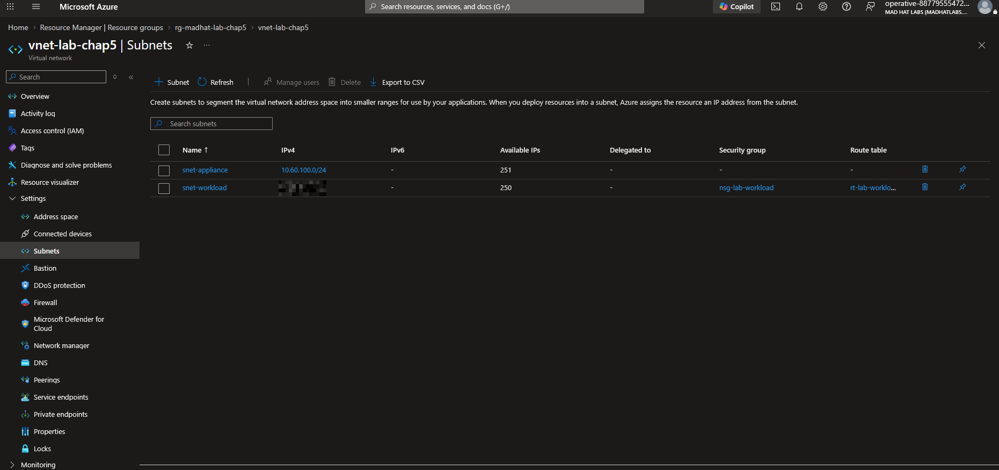
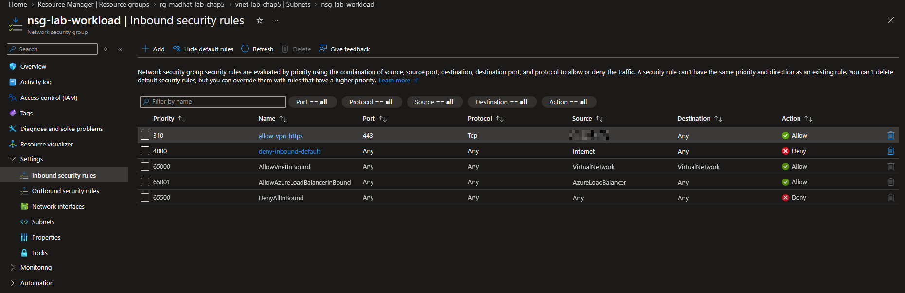
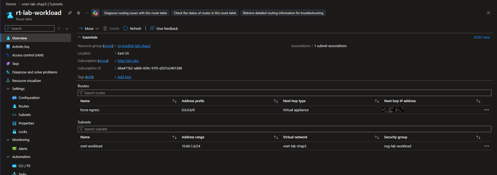
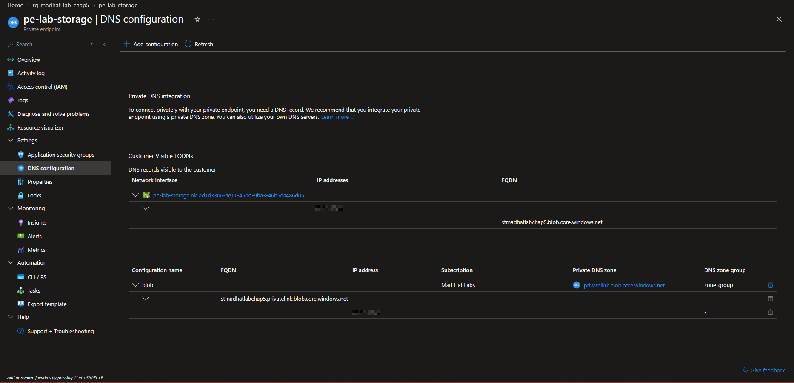
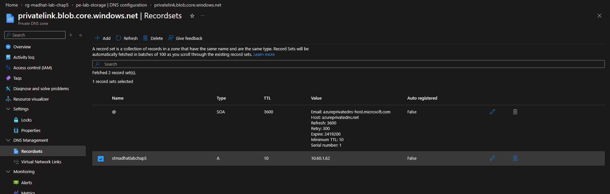
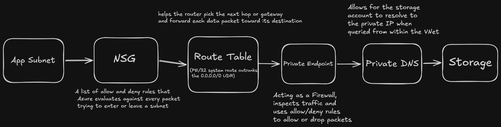

# Network like an Operative

## THE TICKET: "Our new service can reach the customer-data storage account, but I don't understand why or how. Can someone walk me through the network path?" - App Team

## THE TRACE: 

### THE VNET: 
I observed there were two subnets in production, but only one had a NSG and route table attached to it. This was subnet snet-workload. This is where the traffice starts, it's range is 10.60.1.0/24.  

### THE NSG: 
Observing the NSG, I saw there were two custom inbound security rules configured. The top custom rule's name is allow-vpn-https and was configured to only allow HTTPS TCP traffic through port 443 from Source IP 203.0.113.50 specifically. The second custom rule's name is deny-inbound-default and was configured to be a catch-all deny. 

### THE ROUTE:
Looking at the routes, there is only one route configured. It's labeled as force-egress and it's configured to route outbound traffic to a private endpoint at IP 10.60.100.4. Looking at the private endpoint under DNS configuration, there is a /32 route for storage-bound packets that completely bypasses the packets hitting the firewall.

### THE PRIVATE ENDPOINT: 
In the private endpoint,I noticed under DNS configuration that the PE had a network interface that contained an ip address that's within the range of the private subnet (10.60.1.62) and a FQDN configured to the storage account (stmadhatlabchap5.blob.core.windows.net).  

### THE NAME: How did the app find the private address?
Viewing the Private DNS zone privatelink.blob.core.windows.net under recordsets, I could see an A record (IPV4 Address) labeled for the storage account was configured to 10.60.1.62, which happens to be the private IP address for the PE. 

### THE ANSWER: 
The app asks for storage by name, a private DNS zone answers with a private IP belonging to an endpoint inside your own subnet, the packet never leaves the VNet, the NSG outbound defaults allow it, and the endpoint's /32 route outranks the forced tunnel so the firewall never sees it. That is why it works.

## THE DIAGRAM:

## WHAT I WOULD FLAG:
I would bring up the fact that storage traffic completely bypasses inspection and misses the firewall due to a higher priority route and if the network team is aware of this. 
