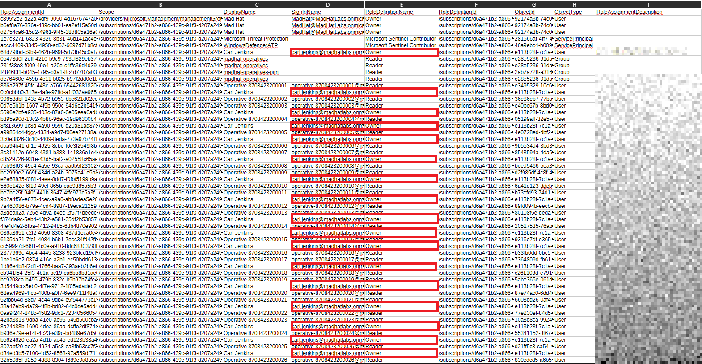
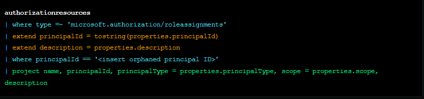
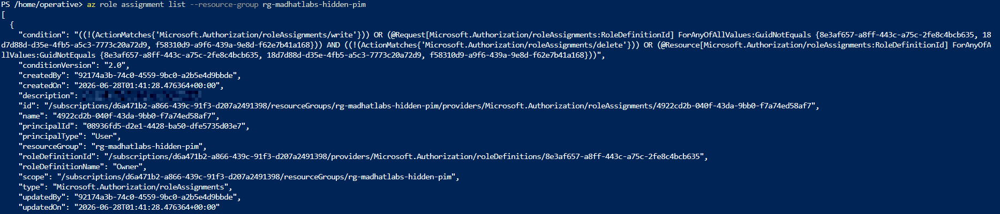

# The-Privledge-Audit

## Scope and Methodology

### In scope
* Mad Hat Labs tenant 
* Reader,Operative Access

### Methodlogy

| Method               | Sees                                        | Misses                              |
|----------------------|---------------------------------------------|-------------------------------------|
| IAM blade / export   | Active assignments at scope, inherited      | Group members, orphaned principals  |
| Azure CLI            | Same, plus empty principalName (orphans)    | One scope per run                   |
| Resource Graph (KQL) | Entire tenant in one query                  | Eligible assignments                |
| PIM export           | Eligible vs active, activation history      | Assignments outside PIM             |

## Findings and recommendations

### Access Control (IAM) blade and the role assignment export

Finding: Redundant Owner roles across multiple resources.

Sees: Active Assignments at scope, inherited

Blindspot: It lists groups but not their members, and it usually buries the orphaned "Identity not found" assignments. 

Severity Rank: High

Reasoning of Severity Rank: In current conditions,the redundant Owner role designations would result in a giant blast radius if a user with the Owner role is compromised.  

Recommendation: Replace redundant Owner grants with the narrowest job-function role at the narrowest scope. 

### Azure CLI

Finding: Orphaned account found 

Sees: Same information as IAM Blade, plus empty principalName (orphan accounts)

Blind spot: It can only run one scope at a time

Severity Rank: High

Reasoning of Severity Rank: An orphaned account is when a role assignment is still active when the tied principal has been deleted. Azure doesn't store the principal name, but the GUID. If anything recreated a principal with that exact same ID, the permissions from the active role assignment would still be in play and applied to that principal. An orphaned account has potential for abuse for a dormant account with access that isn't being monitored.  

Recommendation: Revoke orphaned assignment. 

### Azure Resource Graph with KQL 

Finding:

Sees: Checks the entire tenant in a single query instead of one scope at a time.

Blindspot: It only sees ACTIVE assignments.

Severity Rank:

Reasoning of Severity Rank:

Recommendation:

### Privileged Identity Management export

Finding: User account found to have permanent active assignment. 

Sees: The only method that shows eligible versus active

Blindspot: Does not cover standing assignments that were never brought under PIM

Severity Rank: High

Reasoning of Severity Rank: Permanent active assignment to a user leaves the door open for a malicious actor to gain access to highly sensitive resources.  

Recommendation: Create new Group or assign user to a group that has an eligible role assignment to the resource group. This would increase visbility and monitoring to see who accessed what, and when. Utilzing the just-in-time model prevents malicious actor from performing priviledged tasks, decreasing the blast radius while giving an authorized user the access needed as required. 

### The Hunt
 
 Finding:

 

 Severity Rank: High

 Reasoning of Severity Rank: 

 Recommendation: Move standing privileged access to PIM-eligible with MFA, justification, and time limits. 
 

## What I learned
* Each tool for auditing has different advantages and downsides.
* Disabling a principal will not automatically disable the tied role assignment. Must be through about disabling users and permissions. 
* Audit reports are similiar to investigation reports, but have a bigger focus on documenting findings. 